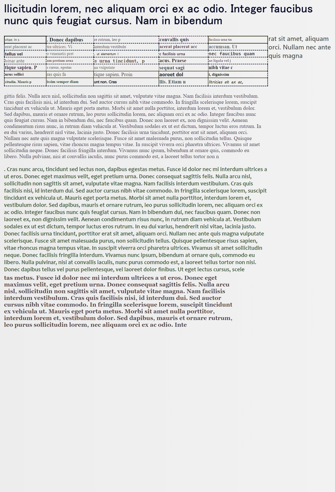
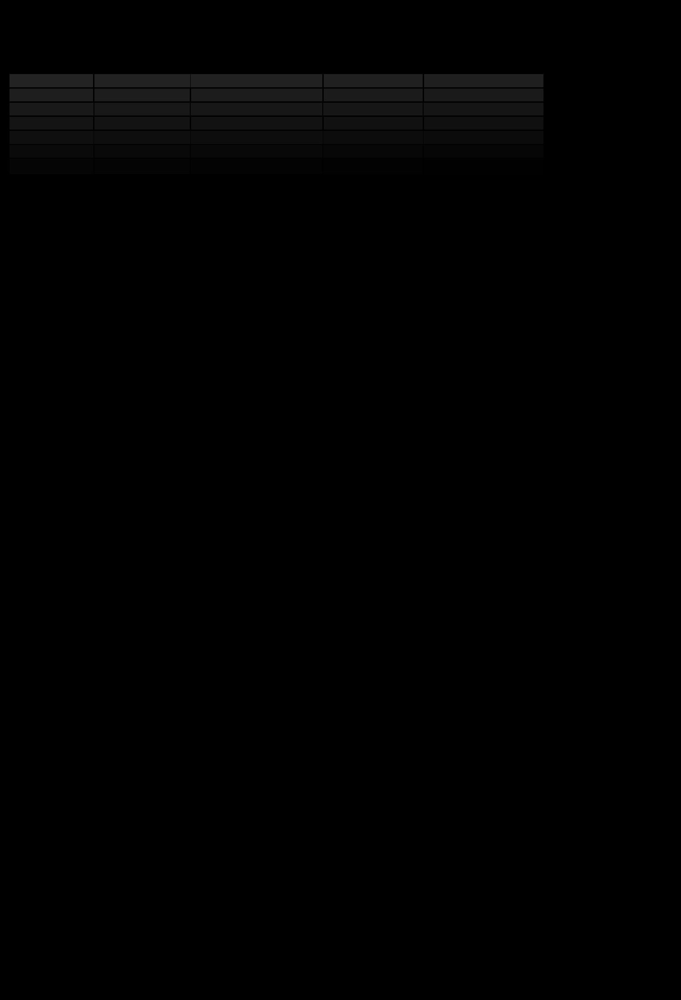
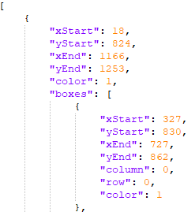

# PythonHtmlTableCreator
This is a small program to generate tables including annotations for the tabel, the table lines and the cells.

## Requirements
For this repository python 3.9 was used. Only a couple of packages are required. 
Just install the requirements.txt:
`pip install -r requirements.txt` 

## Parameters
First of all you can change the 'index.html' (or create your own) including css however you want. Therefore, 
you can make the documents look the way you want them. Within the html template a couple of placeholders are used.
See 'templates/index.html'. The placeholders are `/*#bodyStyle*/` (make sure your html body tag has it as id/class), 
this tag is used to style the body and therefore the entire background of the document. `/*#custom*/` is used to turn 
everything but the maskable elements black. Those tags a replaced during run time randomly, 
so make sure you keep them in your template.

### Content parameters
within your template files (e.g. index.html) you can use those tags: 
   `#tag_headline_0#`, `#tag_table_0#`, `#tag_text_0#`, `#tag_random_0#`

Make sure when you use multiple times the same tag, that the number at the end is changing e.g.
`#tag_headline_0#` -> `#tag_headline_1#` -> `#tag_headline_2#` ...

All those tags are automatically replaced during runtime. `#tag_headline_0#` for a headline. `#tag_table_0#` for a table.
`#tag_text_0#` for a div filled with text. `#tag_random_0#` is randomly replaced for one of the others.

### TableCreator parameters
To configure text length, alignment, font size... see the TableCreator.py file

## Output
A brief overview of the files generated by the program

## Image of the table
These files are in the 'doc' folder. They are the 'regular' Document as a jpg

## Cell mask of the table
The cell masks are in the 'mask_cell' folder. It is a grayscale image with a black background.
Every cell has a different color, starting from 1. Therefore, it is hard to see them on the image.

## Table mask
The table masks are in the 'mask_table' folder. It is a grayscale image with a black background.
Every table has a different color, starting from 1.

## Table line mask
The table line masks are in the 'mask_table_line' folder. It is a grayscale image with a black background.
Every table has a different color, starting from 1.

## Boxes
The box json files are contained within the 'box' folder. It is a simple array containing the boxes for each table.
Every table box has an attribute 'boxes' with all cell boxes. 
The cell boxes include additional information about the row and column of the box.
Cell boxes and table boxes include the left top corner (xStart, yStart) and the bottom right corner (xEnd, yEnd),
as well as the color used in the mask image file.

